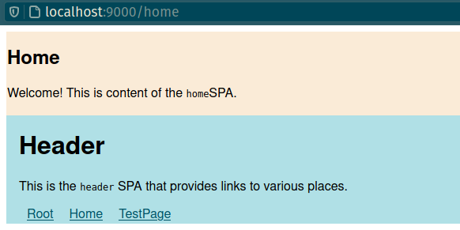

## single-spa Demo 1

This micro frontend (MFE) demo is based on `single-spa` and it contains the root config (application shell in MFE terminology), plus 3 MFE apps: `header`, `home`, and `test-page`.

All four were created using `create-single-spa`.

<br/>

### Start

Start all of them to listen on different ports using:

- `root`: `cd sspa-d1-root && yarn start --port 9000`
- `header`: `cd sspa-d1-header && yarn serve --port 9001`
- `home`: `cd sspa-d1-home && yarn serve --port 9002`
- `testpage`: `cd sspa-d1-testpage && yarn serve --port 9003`

<br/>

### Notes

`create-single-spa` was installed using `yarn global add create-single-spa`.<br/>
In order to have it available in the PATH use `export PATH="$PATH:$(yarn global bin)"`.

#### `root` SPA

Created using:

```shell
❯ create-single-spa
? Directory for new project sspa-d1-root
? Select type to generate single-spa root config
? Which package manager do you want to use? yarn
? Will this project use Typescript? No
? Would you like to use single-spa Layout Engine No
? Organization name (can use letters, numbers, dash or underscore) sspa-d1
   create package.json
   ...
Done in 24.65s.
Project setup complete!
Run 'yarn start' to boot up your single-spa root config
❯
```

#### `header`, `home`, and `testpage` SPAs

All these three SPAs were created in a similar way:

```shell
❯ create-single-spa
? Directory for new project sspa-d1-header
? Select type to generate single-spa application / parcel
? Which framework do you want to use? vue
? Organization name (can use letters, numbers, dash or underscore) sspa-d1
  ...
Vue CLI v4.5.13
? Please pick a preset: Default (Vue 3) ([Vue 3] babel, eslint)
? Pick the package manager to use when installing dependencies: Yarn
...
Project setup complete!
Steps to test your Vue single-spa application:
1. Run 'yarn serve'
2. Go to http://single-spa-playground.org/playground/instant-test?name=@sspa-d1/sspa-d1-header&url=%2F%2Flocalhost%3A8080%2Fjs%2Fapp.js&framework=vue to see it working!
❯
```

### Issues

Currently, two issues exist:

1. Routing between the components generates a full page reload.
2. Sometimes, MFEs are displayed wrongly: Header is always first, then either Home or TestPage is "mounted" below, depending on the route. But sometimes, you may see such result:<br/>
